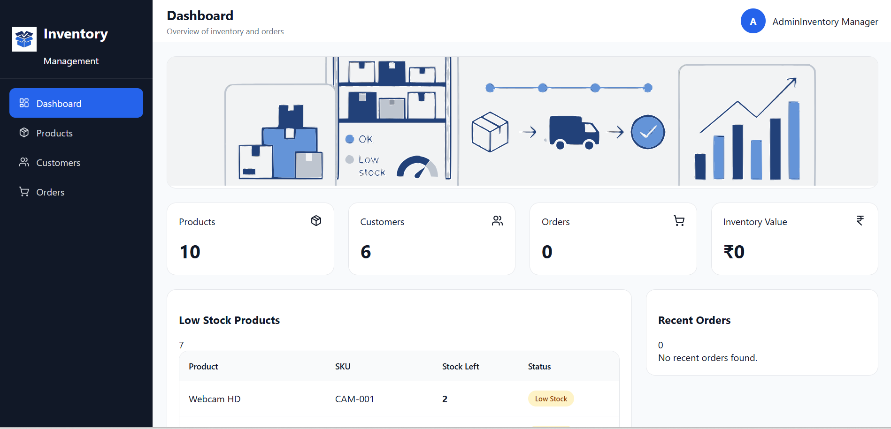
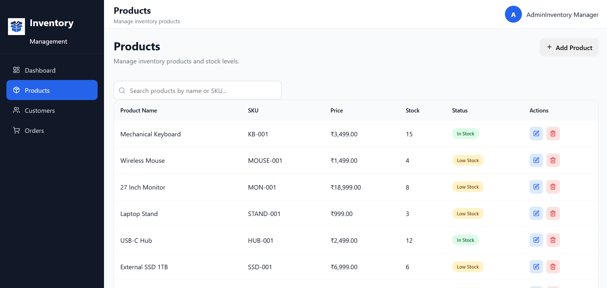
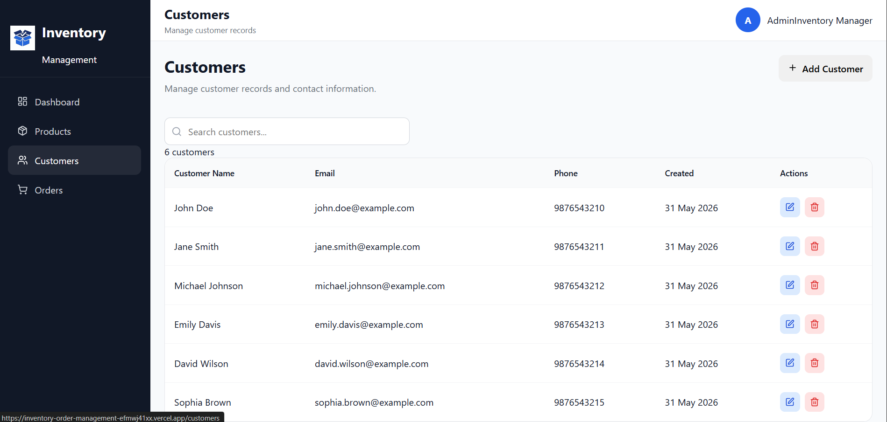
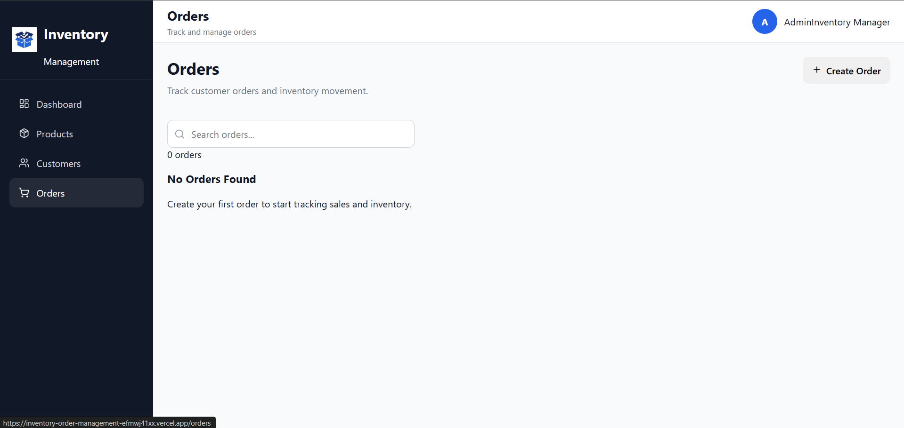

# Inventory Order Management System

A modern full-stack Inventory & Order Management application built with **React**, **FastAPI**, **PostgreSQL**, **Docker**, and **Alembic**.

The system enables businesses to efficiently manage products, customers, orders, inventory levels, and operational analytics through a responsive dashboard.

---

## Live Demo

### Frontend

```text
https://your-app.vercel.app
```

### Backend API

```text
https://your-backend.onrender.com
```

### API Documentation

```text
https://your-backend.onrender.com/docs
```

### Docker Hub Image

```text
https://hub.docker.com/r/your-dockerhub-username/inventory-backend
```

---

# Features

## Dashboard

* Inventory Overview
* Product Statistics
* Customer Statistics
* Order Statistics
* Inventory Value Calculation
* Low Stock Alerts
* Recent Orders Feed

## Product Management

* Create Products
* Update Products
* Delete Products
* SKU Management
* Stock Tracking
* Product Search

## Customer Management

* Create Customers
* Update Customers
* Delete Customers
* Email Validation
* Customer Search

## Order Management

* Create Orders
* Multiple Line Items
* Automatic Inventory Deduction
* Order Details View
* Order History
* Inventory Validation

## Backend Features

* RESTful API
* PostgreSQL Database
* Alembic Migrations
* Pydantic Validation
* Service Layer Architecture
* Global Exception Handling

## DevOps Features

* Dockerized Backend
* Dockerized Frontend
* Docker Compose Support
* GitHub Actions CI
* Render Deployment
* Vercel Deployment

---

# Tech Stack

## Frontend

* React 18
* Vite
* React Router
* Axios
* React Hook Form
* Zod
* Lucide React
* React Hot Toast

## Backend

* FastAPI
* SQLAlchemy
* PostgreSQL
* Alembic
* Pydantic
* Uvicorn

## Infrastructure

* Docker
* Docker Compose
* GitHub Actions
* Render
* Vercel

---

# Project Structure

```text
inventory-order-management/
│
├── backend/
├── frontend/
├── docs/
├── screenshots/
├── docker-compose.yml
└── README.md
```

---

# Architecture


```text
React Frontend
       │
       ▼
FastAPI REST API
       │
       ▼
PostgreSQL Database
```

The backend follows a layered architecture consisting of:

```text
API Layer
    │
Service Layer
    │
Database Layer
    │
PostgreSQL
```

This structure improves maintainability, scalability, and testability.

---

# Screenshots

## Dashboard



The dashboard provides inventory metrics, business statistics, low-stock alerts, and recent order activity.

---

## Products Management



Manage products, pricing, stock levels, and SKU information through a searchable product catalog.

---

## Customers Management



Manage customer information including names, email addresses, and contact details.

---

## Orders Management



Create and manage customer orders with automatic inventory updates and order tracking.

---

## Mobile Responsive View


Fully responsive user interface optimized for mobile and tablet devices.

---

# Local Setup

## Clone Repository

```bash
git clone https://github.com/your-username/inventory-order-management.git

cd inventory-order-management
```

---

## Backend Setup

```bash
cd backend

python -m venv venv

# Linux / Mac
source venv/bin/activate

# Windows
venv\Scripts\activate

pip install -r requirements.txt
```

Create environment file:

```bash
cp .env.example .env
```

Run migrations:

```bash
alembic upgrade head
```

Seed database:

```bash
python -m app.db.seed
```

Start server:

```bash
uvicorn app.main:app --reload
```

Backend URL:

```text
http://localhost:8000
```

Swagger Documentation:

```text
http://localhost:8000/docs
```

---

## Frontend Setup

```bash
cd frontend

npm install
```

Create environment file:

```bash
cp .env.example .env
```

Start frontend:

```bash
npm run dev
```

Frontend URL:

```text
http://localhost:5173
```

---

# Docker Setup

Run the complete application:

```bash
docker compose up --build
```

Services:

```text
Frontend:
http://localhost:5173

Backend:
http://localhost:8000

Swagger:
http://localhost:8000/docs
```

---

# Environment Variables

## Backend

```env
DATABASE_URL=
CORS_ORIGINS=
LOW_STOCK_THRESHOLD=
```

## Frontend

```env
VITE_API_BASE_URL=
```

---

# API Documentation

Detailed endpoint documentation:

```text
docs/api-endpoints.md
```

Swagger UI:

```text
/api/docs
```

---

# Deployment

Deployment instructions:

```text
docs/deployment-guide.md
```

Deployment stack:

```text
Frontend → Vercel

Backend → Render

Database → Render PostgreSQL
```

---

# Continuous Integration

GitHub Actions automatically:

* Installs backend dependencies
* Validates backend imports
* Builds frontend application
* Verifies Docker image builds

Workflow:

```text
.github/workflows/ci.yml
```

---

# Database Migrations

Create migration:

```bash
alembic revision --autogenerate -m "migration_name"
```

Apply migrations:

```bash
alembic upgrade head
```

Rollback migration:

```bash
alembic downgrade -1
```

---

# Future Enhancements

* Authentication & Authorization
* Role-Based Access Control
* Inventory Reports
* CSV Export
* PDF Invoice Generation
* Order Status Tracking
* Audit Logging
* Unit Tests
* Integration Tests

---

# Submission Links

## GitHub Repository

```text
https://github.com/your-username/inventory-order-management
```

## Backend Docker Hub Image

```text
https://hub.docker.com/r/your-dockerhub-username/inventory-backend
```

## Frontend Hosted URL

```text
https://your-app.vercel.app
```

## Backend API URL

```text
https://your-backend.onrender.com
```

---

# Author

Your Name

GitHub:

```text
https://github.com/your-username
```

LinkedIn:

```text
https://linkedin.com/in/your-profile
```

---

# License

This project was developed as part of a technical assessment and is intended for educational and evaluation purposes.
